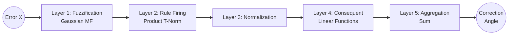
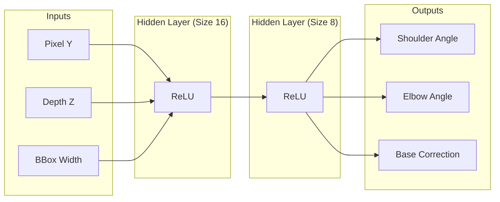
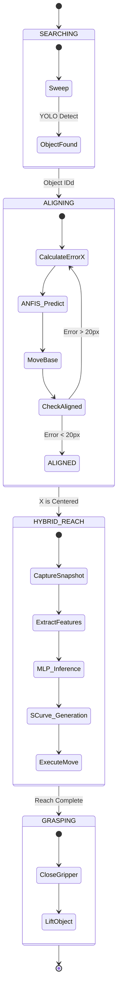

# 🤖 AI-Powered 6-DOF Robotic Arm System

**A professional-grade autonomous robotic manipulator featuring hybrid Neuro-Fuzzy and Neural Network control systems.**

---

## 📖 Table of Contents
1. [Project Overview](#-project-overview)
2. [System Architecture](#-system-architecture)
3. [Hardware & Low-Level Control](#-hardware--low-level-control)
4. [Computer Vision System](#-computer-vision-system)
5. [The "Brain": Hybrid Control Logic](#-the-brain-hybrid-control-logic)
   - [Phase 1: ANFIS Alignment (Deep Dive)](#phase-1-anfis-alignment-deep-dive)
   - [Phase 2: MLP Visual Compensation (Deep Dive)](#phase-2-mlp-visual-compensation-deep-dive)
   - [Phase 3: Execution Control Flow](#phase-3-execution-control-flow)
6. [Data Collection & Training](#-data-collection--training)
7. [Installation & Usage](#-installation--usage)

---

## 🔭 Project Overview

This project implements an intelligent control system for a 6-Degree-of-Freedom (6-DOF) robotic arm. Unlike traditional hard-coded automation, this system utilizes **Machine Learning** to perceive the environment and execute complex manipulation tasks.

**Key Capabilities:**
*   **Visual Perception:** Detects and tracks objects in real-time using YOLOv8/v11.
*   **Adaptive Alignment:** Uses an **ANFIS (Adaptive Neuro-Fuzzy Inference System)** controller to mimic human-like corrective movements for centering.
*   **Learned Kinematics:** Uses a **Multi-Layer Perceptron (MLP)** neural network to predict inverse kinematics and compensate for physical mechanical drift.
*   **Smooth Motion:** Implements S-Curve velocity profiling for natural, jerk-free movements.

---

## 🏗 System Architecture

The system operates on a Host-Client architecture, decoupling the high-performance AI processing from the low-latency hardware control.

```mermaid
graph TD
    subgraph "Host Computer (Python Backend)"
        Vision[Computer Vision<br/>(YOLO / OpenCV)]
        Logic[Control Logic<br/>(Visual Servoing Agent)]
        ML[ML Models<br/>(ANFIS / MLP)]
        Flask[Web Server<br/>(UI / Telemetry)]
    end

    subgraph "Embedded Controller (Arduino)"
        Serial[Serial Parser]
        ServoLib[Servo Library]
        Sensors[Ultrasonic Sensor]
    end

    subgraph "Hardware"
        Arm[6-DOF Robotic Arm]
        Cam[Webcam]
    end

    Cam -->|Video Feed| Vision
    Vision -->|Error & Depth| Logic
    Logic <-->|Predictions| ML
    Logic -->|Angle Commands| Serial
    Serial -->|PWM Signals| Arm
    Sensors -->|Distance Data| Serial
```

---

## ⚙ Hardware & Low-Level Control

### Servo Motor Control (PWM)
The robotic arm is powered by standard servo motors. These motors are controlled using **Pulse Width Modulation (PWM)** signals.

*   **Principle:** A servo motor reads a digital pulse sent every 20ms (50Hz).
*   **Mapping:** The width of the high pulse determines the angle:
    *   **0.5ms - 1.0ms** → 0°
    *   **1.5ms** → 90° (Neutral)
    *   **2.0ms - 2.5ms** → 180°
*   **Implementation:** The Arduino's hardware timers generate these precise pulses based on the angle values received from the computer.

### Arduino Communication
The Arduino acts as a bridge between the high-level Python logic and the low-level hardware.

*   **Protocol:** Serial (USB) at **115200 baud**.
*   **Command Format:** `<Base, Shoulder, Elbow, WristP, WristR, Gripper>`
    *   *Example:* `<90,120,45,90,90,0>` (Move to specific pose)
*   **Response:**
    *   `K`: Acknowledgment (Ready for next command).
    *   `<DIST_VALUE>`: Returns ultrasonic distance reading when requested.

---

## 👁 Computer Vision System

### Object Detection (YOLO)
We utilize **YOLO (You Only Look Once)**, a state-of-the-art real-time object detection model.
*   **Models:** `yolov8n.pt` (Speed) or `yolov8s-world.pt` (Open Vocabulary).
*   **Function:** Identifies the target object (e.g., "bottle") and returns its **Bounding Box**.
*   **Output:** Center pixel coordinates $(x, y)$ and bounding box width ($w$).

### Depth Estimation
Distance to the object is critical for grasping. We use two methods:
1.  **Pinhole Camera Model:** Uses the known physical size of the object and its apparent pixel size to calculate distance.
    $$ D = \frac{F \times W_{real}}{W_{pixel}} $$
    *   *F = Focal Length, W = Width*
2.  **Monocular Depth:** Neural network-based dense depth map generation (optional backup).

---

## 🧠 The "Brain": Hybrid Control Logic

The core innovation is the **Hybrid Visual-Compensation System**, which splits the control task into specialized phases.

### Phase 1: ANFIS Alignment (Deep Dive)

Before reaching, the robot must face the object directly. Simple P-controllers oscillate, so we use **ANFIS (Adaptive Neuro-Fuzzy Inference System)**.

**Concept:**
It mimics human intuition ("Turn a little bit left") but refines it significantly using a learned neural network structure.

**ANFIS Mathematical Architecture (5 Layers):**



1.  **Layer 1 (Fuzzification):** Calculates membership degrees ($\mu$).
    $$ \mu_{A_i}(x) = \exp\left(-\frac{1}{2}\left(\frac{x - c_i}{\sigma_i}\right)^2\right) $$
2.  **Layer 2 (Rules):** Computes firing strength ($w_i$).
3.  **Layer 3 (Normalization):** $\bar{w}_i = w_i / \sum w$.
4.  **Layer 4 (Consequent):** Computes rule outputs $f_i = p_i x + q_i$.
5.  **Layer 5 (Sum):** Final output = $\sum \bar{w}_i f_i$.

---

### Phase 2: MLP Visual Compensation (Deep Dive)

Once aligned, the robot must reach out. Analytical Inverse Kinematics (IK) fails due to mechanical sagging and camera errors. We use a **Multi-Layer Perceptron (MLP)** regressor to predict the perfect motor angles directly from visual features.

**Neural Architecture:**



**Inputs (The "Eyes"):**
1.  **Pixel Y:** Vertical position.
2.  **Depth Z:** Estimated distance.
3.  **BBox Width:** A robust proxy for distance.

**Outputs (The "Muscles"):**
The model predicts the exact **Shoulder** and **Elbow** angles to reach that spot, PLUS a **Base Correction** angle to compensate for any physical twisting (drift) of the robot arm during extension.

---

### Phase 3: Execution Control Flow

How the system makes decisions in real-time:



**S-Curve Smoothing:**
To prevent jerk, all movements follow a generated velocity profile:
$$ s(t) = 3t^2 - 2t^3 $$

---

## 📂 Data Collection & Training

To train the MLP, we use an **Experience Replay** strategy:

1.  **Collection Script:** `backend/collect_visual_compensation_data.py`
    *   The robot auto-aligns (ANFIS).
    *   The human operator manually guides the robot to a perfect grasp using keyboard controls.
    *   The system records the **Visual State** (Inputs) and the **Successful Motor State** (Labels).
2.  **Training:**
    *   The model learns to map the Visual State to the Motor State using Backpropagation (MSE Loss).

---

## 🚀 Installation & Usage

### Prerequisites
*   Python 3.10+
*   Node.js (for Dashboard)
*   Arduino IDE

### Setup
1.  **Flash Arduino:** Upload `backend/robotic_arm_controller.ino`.
2.  **Install Python Deps:** `pip install -r backend/requirements.txt`
3.  **Install Frontend:** `cd frontend && npm install`

### Operation
1.  **Start the Brain:**
    ```bash
    python backend/app.py
    ```
2.  **Start the UI:**
    ```bash
    cd frontend && npm run dev
    ```
3.  **Web Interface:** Go to `localhost:8080`, select "bottle", and click **START**.

---

**Developed for Advanced Agentic Coding - Google DeepMind**
