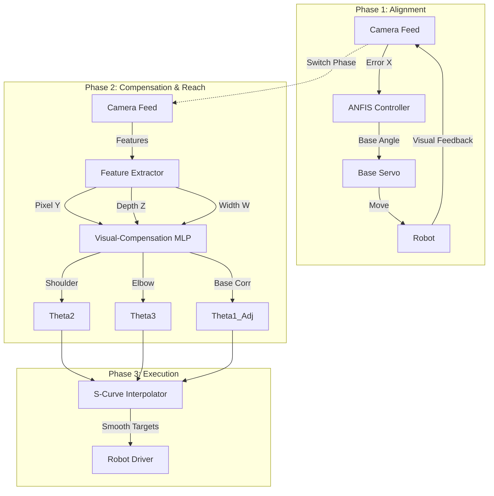
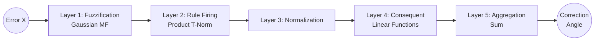
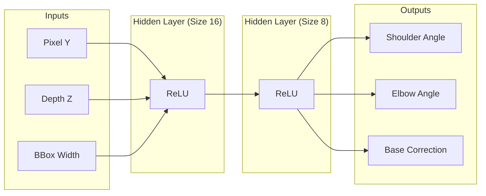
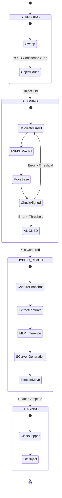

# 🧠 Hybrid Control System: Technical Deep Dive

**A detailed architectural analysis of the Neuro-Fuzzy and Neural Network control systems powering the robotic arm.**

---

## 📚 Table of Contents
1. [System Architecture Diagram](#system-architecture-diagram)
2. [Phase 1: ANFIS X-Axis Alignment](#phase-1-anfis-x-axis-alignment)
    - [What is ANFIS?](#what-is-anfis)
    - [Network Architecture](#anfis-network-architecture)
    - [Mathematical Flow](#mathematical-flow)
3. [Phase 2: MLP Visual-Compensation](#phase-2-mlp-visual-compensation)
    - [Neural Architecture](#neural-architecture)
    - [Inputs & Features](#inputs--features)
    - [Training Process](#training-process)
4. [Phase 3: Integration & Execution](#phase-3-integration--execution)
    - [Control Flow Diagram](#control-flow-diagram)

---

## 🏗 System Architecture Diagram

The system uses a **Hybrid Serial Architecture**. It does NOT attempt to solve the entire 6-DOF problem at once. Instead, it decouples the problem into **Alignment (X)** and **Reach (YZ)**.

---

## 🧭 Phase 1: ANFIS X-Axis Alignment

### What is ANFIS?
**ANFIS (Adaptive Neuro-Fuzzy Inference System)** combines the interpretability of **Fuzzy Logic** with the learning capabilities of **Neural Networks**.

*   **Fuzzy Logic:** Uses "degrees of truth" rather than binary True/False.
    *   *Example:* An object is "Slightly Left" (0.8) and "Moderately Left" (0.2).
*   **Neural Network:** Tunes the shape of these definitions (Membership Functions) and the rules during training.

### ANFIS Network Architecture
We use a **5-Layer Architecture** implemented in PyTorch (`brain/anfis_pytorch.py`).

### Mathematical Flow
1.  **Layer 1 (Fuzzification):** Determines "How much does x belong to set A?". We get degrees of membership ($\mu$) using learnable Gaussian functions.
    $$ \mu_{A_i}(x) = \exp\left(-\frac{1}{2}\left(\frac{x - c_i}{\sigma_i}\right)^2\right) $$
    *(Where $c$ and $\sigma$ are learnable parameters)*

2.  **Layer 2 (Rules):** Computes the "firing strength" ($w_i$) of each rule.
    *   *Rule 1:* IF Error is Large Negative THEN...
    *   *Rule 2:* IF Error is Small Positive THEN...

3.  **Layer 3 (Normalization):** Normalizes the firing strengths.
    $$ \bar{w}_i = \frac{w_i}{\sum w_j} $$

4.  **Layer 4 (Consequent):** Computes the output for each rule (Takagi-Sugeno Model).
    $$ f_i = p_i x + q_i $$
    *(Where $p$ and $q$ are learnable weights)*

5.  **Layer 5 (Output):** Sums the weighted outputs.
    $$ Output = \sum \bar{w}_i f_i $$

**Why ANFIS?** It mimics human intuition ("Turn a little bit left") but refines it mathematically for precision, preventing the oscillations common in PID controllers.

---

## 👁 Phase 2: MLP Visual-Compensation

Once aligned, the problem shifts to **Forward Reach**. Standard kinematics fail here due to:
1.  **Pinhole Error:** Depth estimation $Z = \frac{f \cdot W}{w}$ is noisy.
2.  **Mechanical Sag:** The arm droops under gravity when extended.
3.  **Drift:** The base may twist slightly under load.

We solve this with a **Supervised Regression Multi-Layer Perceptron (MLP)**.

### Neural Architecture
We use a compact but dense network (trainable in seconds) defined in `train_visual_compensation.py`.

*   **Type:** Feed-Forward Neural Network
*   **Input Layer:** 3 Neurons (StandardScaler Normalized)
*   **Hidden Layer 1:** 16 Neurons (ReLU Activation)
*   **Hidden Layer 2:** 8 Neurons (ReLU Activation)
*   **Output Layer:** 3 Neurons (Linear Activation)

### Inputs & Features
1.  **Pixel Y ($p_y$):** Vertical position in the image. High $p_y$ = Object is lower/closer.
2.  **Depth ($d$):** Estimated $Z$ distance from pinhole model. Primary distance cue.
3.  **BBox Width ($w$):** Width in pixels. A redundant but robust proxy for distance (Complementary to Depth).

### Learning Objective
The model learns the function $F(p_y, d, w) \rightarrow (\theta_{shoulder}, \theta_{elbow}, \theta_{base\_adj})$.

It implicitly learns:
*   **Inverse Kinematics:** Converting $(Y, Z)$ cartesian coordinates to $(\theta_S, \theta_E)$.
*   **Gravity Compensation:** Adding offsets to angles to counteract sagging.
*   **Drift Correction:** Adding a $\pm \theta_{base}$ offset based on extension length.

---

## ⚙ Phase 3: Integration & Execution

The systems are integrated into a **State Machine** in `visual_servoing.py`.

### Control Flow Diagram

**Key Integration details:**
*   **Snapshotted Inference:** The MLP runs **once** per grasp attempt on a stationary image to prevent "chasing" noise.
*   **Base Correction Summation:** The Base Servo Final Angle = $Align\_Angle_{ANFIS} + Correction_{MLP}$. This allows the MLP to fine-tune the coarse alignment provided by ANFIS.
