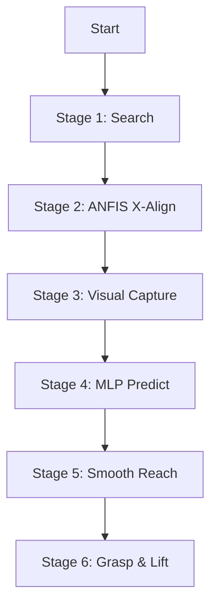

# Hybrid Visual-Compensation System Documentation

## 1. System Concept: "Learn to Compensate"

This system implements a **Hybrid Visual-Compensation Control Strategy** for a robotic arm. It solves the critical problem of depth estimation inaccuracies and mechanical drift by **learning** the relationship between visual features and optimal motor angles, rather than relying solely on geometric calculations.

### Core Philosophy
Instead of trying to perfectly calibrate the camera and robot kinematics (which is brittle), we use a **data-driven approach**:
1.  **ANFIS (X-Axis)**: Uses fuzzy logic for fast, interpretable alignment of the base rotation.
2.  **MLP (Y/Z-Axis + Base Correction)**: Uses a neural network to learn the complex, non-linear relationship between:
    *   Visual inputs (pixel_y, pinhole depth, object size)
    *   Optimal motor angles (shoulder, elbow)
    *   **Drift Compensation**: Automatically corrects for the X-axis drift that occurs when the arm extends suited for different depths.

---

## 2. Key Problem Solved

### The "Pinhole Problem"
Simple pinhole camera models estimate depth ($Z$) using $Z = \frac{f \cdot W}{w_{px}}$.
*   **Issue**: This is noisy and inaccurate due to lens distortion and object variations.
*   **Solution**: We add `bbox_width` as a direct input feature. The MLP learns that "wider bbox = closer object" implicitly, correcting the noisy depth estimate.

### The "Drift Problem"
When the robot shoulder/elbow move to reach forward, the end-effector often drifts slightly left/right due to mechanical imperfections or non-perfect vertical alignment.
*   **Solution**: The dataset collects `base_correction`. The MLP learns to predict this correction value based on the target distance, ensuring the grasp is centered even at full extension.

---

## 3. System Architecture

The runtime system uses two models running in parallel:

### Model 1: ANFIS (X-Alignment)
*   **File**: `backend/brain/models/anfis_x.pth`
*   **Type**: Adaptive Neuro-Fuzzy Inference System
*   **Input**: `error_x` (pixels)
*   **Output**: `base_correction` (degrees)
*   **Role**: Rapidly centers the object in the camera view before the reach begins.

### Model 2: Visual-Compensation MLP (Reach)
*   **File**: `backend/brain/models/visual_compensation_model.pth`
*   **Type**: Multi-Layer Perceptron (3-16-8-3)
*   **Inputs**:
    1.  `pixel_y`: Vertical position in frame (0 = center)
    2.  `depth_cm`: Initial depth estimate from pinhole model
    3.  `bbox_width`: Raw width of object bounding box (pixels)
*   **Outputs**:
    1.  `shoulder_angle`: Target shoulder angle
    2.  `elbow_angle`: Target elbow angle
    3.  `base_correction`: Additional base rotation to compensate for drift

---

## 4. Operational Workflow

The system follows a strict 6-stage hybrid workflow:

1.  **Search**: Robot sweeps base (0-180°) until YOLO detects the target object.
2.  **X-Align**: ANFIS model predicts base rotations to center the object ($error_x \approx 0$).
3.  **Capture**: System freezes visual data (`pixel_y`, `depth`, `width`).
4.  **Predict**: MLP calculates the "Blind Reach" coordinates.
5.  **Reach**: Robot moves using S-Curve interpolation (simultaneously applying base drift correction).
6.  **Grasp**: Gripper closes, object acts as a mechanical stop if slightly off-depth.

---

## 5. Development Pipeline

### Step 1: Data Collection
**Script**: `backend/collect_visual_compensation_data.py`
A specialized tool that combines auto-alignment with manual teaching:
1.  Auto-aligns X-axis.
2.  User manually drives robot to perfect grasp position.
3.  Records the *visual state* (before move) vs. *motor state* (after move).

### Step 2: Training
**Script**: `backend/train_visual_compensation.py`
Trains the MLP using PyTorch:
*   Standardization (Scalers) for inputs/outputs.
*   MSE Loss function.
*   Splits data 80/20 for validation.

### Step 3: Deployment
**Script**: `backend/app.py` (Visual Servoing Agent)
Integrated into the main application logic:
*   Loads both models on startup.
*   Runs the control loop in a background thread.
*   Provides telemetry to the frontend.

---

## 6. Usage Guide

### Running the System
1.  **Start Backend**: `python backend/app.py`
2.  **Open Frontend**: `http://localhost:5000`
3.  **Action**: Click "Start Servoing" and select a target (default: "bottle").

### Maintenance
*   **Retraining**: If grasps are consistently short/long, collect 20-30 new samples using the collection script and run the training script.
*   **New Objects**: Collect data for drastically different objects (e.g., small cubes vs. large bottles) as their `bbox_width` features will differ.
